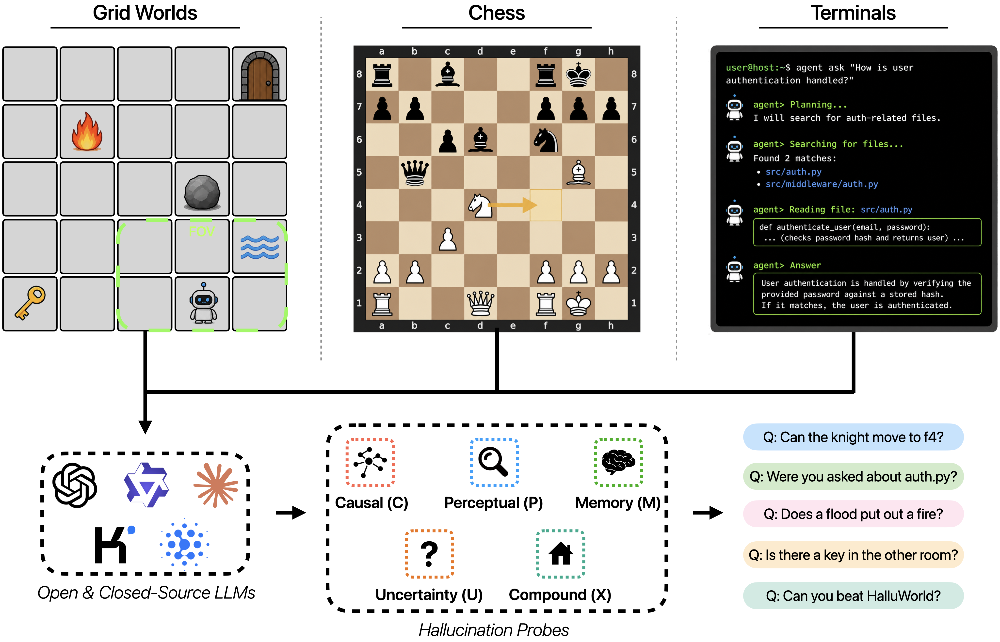

# HalluWorld


[Website](https://halluworld.ai/) · [Benchmark Paper](https://arxiv.org/abs/2605.19341) · [Position Paper](https://arxiv.org/abs/2512.21577) ·
[Dataset](https://huggingface.co/datasets/DegenAI-Labs/HalluWorld)

**A Controlled Benchmark for Hallucination via Reference World Models**



*The HalluWorld benchmark spans three domains (gridworlds, chess, and terminals) and tests models
using five probe categories targeting distinct cognitive skills: Causal (C) tests understanding of
cause-effect relationships, Perceptual (P) tests spatial reasoning and object tracking, Memory (M)
tests retention of past observations, Uncertainty (U) tests reasoning under partial observability,
and Compound/X (X) tests multi-step reasoning across connected environments. Hallucination is
measured by placed probes that query models about environment observations they have seen.*

**1,439 frozen questions** · **4 benchmark tracks** · **5 cognitive categories** · **rule-based scoring** · **no LLM judges**

## 🚀 Quickstart


### 1. Install HalluWorld

```bash
git clone https://github.com/DegenAI-Labs/HalluWorld.git
cd HalluWorld
pip install -e '.[chess]'
```


### 2. Get the question bank

The frozen HalluWorld question bank is hosted as a gated [Hugging Face dataset](https://huggingface.co/datasets/DegenAI-Labs/HalluWorld). Request access, make sure you are logged in, and verify the questions load.

```bash
hf auth login
halluworld questions verify
```


### 3. Configure your model provider

```bash
export OPENAI_API_KEY=...
# or ANTHROPIC_API_KEY / BASETEN_API_KEY
```


### 4. Run a quick test

Start with one episode:

```bash
halluworld eval grid \
  --provider openai \
  --model gpt-4o-mini \
  --levels P1_dense_array \
  --limit 1 \
  --out results/smoke
```

Add `--dry-run` to validate the configuration without making any model calls.

### 5. Run HalluWorld

```bash
halluworld eval grid     --provider openai --model gpt-4o-mini --out results/grid
halluworld eval chess    --provider openai --model gpt-4o-mini --out results/chess
halluworld eval terminal --provider openai --model gpt-4o-mini --out results/terminal
```

See [Evaluation](docs/EVALUATION.md) for provider options, subsets, output formats, and advanced configuration.

## What is HalluWorld?

Hallucination remains a central failure mode of large language models, but existing benchmarks operationalize it inconsistently across tasks such as summarization, question answering, retrieval-augmented generation, and agentic interaction. This fragmentation makes it unclear whether a mitigation that works in one setting actually reduces hallucinations across contexts. Current hallucination benchmarks either require human annotation and fixed references that may eventually be memorized, or rely on naturalistic observations often recorded in settings that are difficult to reproduce or test systematically. 

To enable further research on the root causes of hallucination, we introduce **HalluWorld**, an extensible benchmark framework grounded in an explicit reference-world formulation: **a model hallucinates when it produces an observable claim that is false with respect to this reference world**. Building on this view, we construct a family of synthetic and semi-synthetic benchmark environments in which the reference world is fully specified, the model's observable view is controlled, and hallucination labels can be generated automatically by construction. HalluWorld spans multiple settings that are classically representative for AI — grid worlds, chess, and realistic terminal tasks. This enables controlled variation of key factors such as world complexity, observability, temporal change, and source-conflict policy, allowing us to disentangle hallucinations into more fine-grained error categories.

### Benchmark tracks


| Track        | World                                   | Questions | Measures                                                                                            |
| ------------ | --------------------------------------- | --------- | --------------------------------------------------------------------------------------------------- |
| **Grid**     | MiniGrid 2D environments, 33 levels     | 443       | perception, memory, causal dynamics, uncertainty, and compound reasoning, one tier per level family |
| **Chess**    | chess and two rule variants             | 350       | reasoning over a formal, fully-specified state the model has strong priors about                    |
| **Terminal** | Docker + tmux agent sessions, 110 tasks | 529       | claims about a real filesystem an agent is actively changing                                        |
| **InNav**    | gridworld, probed *during* navigation   | 117       | whether acting while observing helps or hurts, against a paired static control                      |


### Taxonomy

Every item carries a `cognitive_tier`, which is what makes the tracks comparable:


|                   |                                              |
| ----------------- | -------------------------------------------- |
| **P** perceptual  | read the observation as given                |
| **M** memory      | recall state no longer visible               |
| **C** causal      | apply a rule or dynamic to reach a new state |
| **U** uncertainty | decline to answer beyond the evidence        |
| **X** compound    | two or more of the above in one item         |


## Citation

```bibtex
@article{liu2026halluworld,
  title   = {HalluWorld: A Controlled Benchmark for Hallucination via Reference World Models},
  author  = {Liu, Emmy and Gangal, Varun and Yu, Michael and Tao, Zhuofu and
             Singh, Karan and Kumar, Sachin and Feng, Steven Y.},
  journal = {arXiv preprint arXiv:2605.19341},
  year    = {2026}
}
```


## License

[CC BY 4.0](LICENSE) for everything HalluWorld-authored here, code and data alike. The same file
lists the third-party components that keep their own terms, chiefly the vendored Apache-2.0
Terminal-Bench fork under `external/`. Provenance detail is in
[docs/PROVENANCE.md](docs/PROVENANCE.md).

---


## Technical Details


### Versions

The v0.1 question bank is exactly the set of items behind the paper's numbers, so evaluating a model
with the commands above reproduces the paper's setup. v0.2 is the latest benchmark published on the website.

### Python API

```python
from halluworld import run_benchmark
from halluworld.tracks.grid import SymbolicSerializer, PresenceProbe, PresenceEvaluator, make_env
from halluworld.lm import StubLM

results = run_benchmark(
    env=make_env(agent_view_size=7),
    serializer=SymbolicSerializer(),
    probes=[PresenceProbe(positive_rate=0.5)],
    evaluators=[PresenceEvaluator()],
    lm=StubLM(mode="random", seed=0),
    n_episodes=10,
    seed=42,
)
print(results.accuracy("presence"))
```

A run composes five pieces, one per axis: environment × serializer × probe × LM × evaluator.

### Repository Layout

```
halluworld/
  benchmark.py  multiturn.py            the shared run loops
  probe.py  serializer.py  evaluator.py the shared interfaces
  lm/                                   OpenAI, Anthropic, Baseten, stub
  data/                                 levels, configs, terminal tasks; the question bank is fetched, not tracked
  tracks/{grid,chess,innav,terminal}/    everything specific to a track
scripts/                                analysis, migration, orchestration
external/terminal-bench/                vendored Apache-2.0 fork
docs/                                   see below
```


### Documentation


|                                            |                                                        |
| ------------------------------------------ | ------------------------------------------------------ |
| [docs/EVALUATION.md](docs/EVALUATION.md)   | copy-paste model evaluation commands and output layout |
| [docs/BENCHMARK.md](docs/BENCHMARK.md)     | level taxonomy, tiers, the HalluWorld-Hard subset      |
| [docs/QUESTIONS.md](docs/QUESTIONS.md)     | the frozen bank: schema, versioning, how to rebuild it |
| [docs/RESULTS.md](docs/RESULTS.md)         | the result schema and what is published                |
| [docs/REPRODUCING.md](docs/REPRODUCING.md) | what is and is not reproducible                        |


